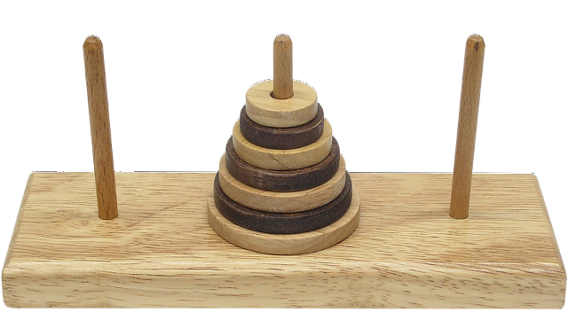
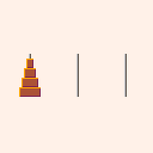

# The tower of Hanoi problem

## How does the tower of Hanoi problem work?
Given \\(n \\) number of rods, and an initial rod stacked with disc incrementally 
getting smaller from bottom to top. The objective is to transfer the entire 
tower from one rod to another under the constraint that:
1. You can only move one disc at a time
2. You cannot place a disc on one smaller than itself
3. After any move, all discs must be on a rod

  
**Figure: Tower of Hanoi**

## Solving the tower of Hanoi problem
It's difficult to design an iterative algorithm to solve such a problem. This is
where the power of recursive algorithms come into play.

```
ALGORITHM TowerOfHanoi(n, a, b, c)
// Find a solution to the problem of moving n disks from rod a to rod c 
// using b as a temporary rod without violating the rules
//
// variables:
//   - n: number of disks
//   - a: starting rod
//   - b: temporary rod
//   - c: end rod

if n > 0
    towerOfHanoi(n - 1, a, c, b)
    move top disk from a to c
    towerOfHanoi(n - 1, b, a, c)
```

  
**Figure: Tower of Hanoi solution**
