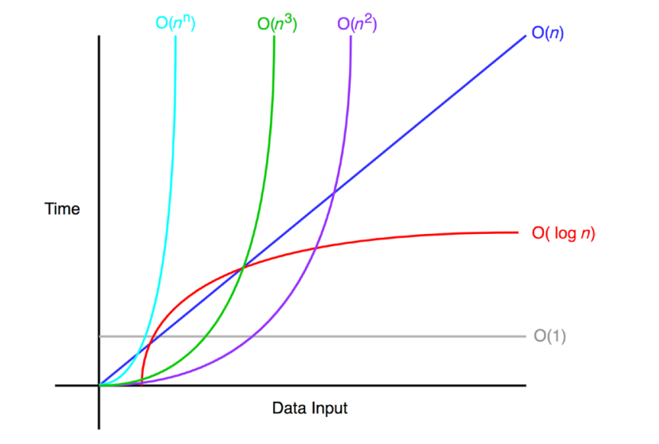

# Big-O notation

Big-O notation is a way of describing the worst-case scenario speed 
and/or complexity of a given algorithm.

Let \\(O(g(n)) \\) be a class containing all functions that are bound above
by some multiple \\(c \\) of \\(g(n) \\). If some function \\(t(n) \\) is in
the class \\(O(g(n)) \\) then it's worst-case behaviour is bound by a function
with the same 'shape' as \\(g(n) \\).

For example, say we have algorithm that takes \\(T \\) time to finish.

\\[
    T(n) = 4n^2 - 2n + 2
\\]

Ignoring constants, we could say that \\(T(n) \\) grows at an order of \\(n^2 \\)
and therefore write:

\\[
    T(n) = O(n^2)
\\]

Big-O notation ignores fine details such as multiplicative constants, bases of
logarithms, and low-order terms in polynomials. Regardless of this, they are
still sufficient enough to distinguish between acceptable algorithms and unacceptable
ones.

For example, an \\(O(n) \\) algorithm will outperform an \\(O(n^2) \\) on average for large
inputs

**Figure: Big-O notation**
