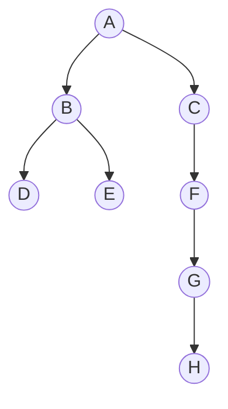

# Introduction

## Binary Tree
A binary tree is a non-linear data structure in which each node has at most two 
children.

In mathematical terms we could describe a binary tree as a set of \\(T\\) nodes
such that either:
- \\(T\\) is empty
- \\(T\\) is partitioned into three disjoint subsets
    - A single node root
    - Two possible empty sets called left and right subtrees of the root
