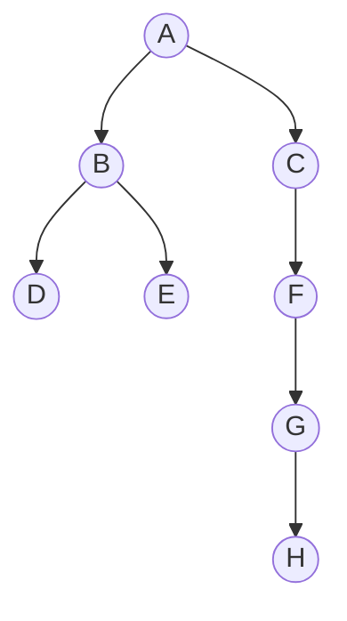

# Binary Tree Traversal

## Traversal
Often, we need the ability to visit each node within a binary tree and examine
the stored value. There are three common orders in which we can achieve this,
each with their own strengths and weaknesses.
1. Pre-order
2. In-order
3. Post-order

## Pre-order Traversal
We can recursively define pre-order traversal as:
1. Start at the root
2. Traverse the left sub-tree in pre-order
3. Traverse the right sub-tree in pre-order

For example, given the following binary tree,

Pre-order would traverse it as such: A B D E C F G H

### Algorithm
```
ALGORITHM Pre-order(root)
if root != null
    visit root.item
    Pre-order(root.lchild)
    Pre-order(root.rchild)
```

Pre-order has an efficiency of \\(O(n)\\), where \\(n\\) represents the number of
nodes within the binary tree.

## In-order Traversal
We can recursively define in-order traversal as:
1. Traverse the left sub-tree in-order
2. Visit the root
3. Traverse the right sub-tree in-order

For example, given the following binary tree,

In-order would traverse it as such: D B E A C G H F

### Algorithm
```
ALGORITHM In-order(root)
if root != null
    In-order(root.lchild)
    visit root.item
    In-order(root.rchild)
```

In-order has an efficiency of \\(O(n)\\), where \\(n\\) represents the number of
nodes within the binary tree.

## Post-order Traversal
We can recursively define post-order traversal as:
1. Traverse the left sub-tree in post-order
2. Traverse the right sub-tree in post-order
3. Visit the root

For example, given the following binary tree,

Post-order would traverse it as such: D B E H G F C A

### Algorithm
```
ALGORITHM Post-order(root)
if root != null
    Post-order(root.lchild)
    Post-order(root.rchild)
    visit root.item
```

Post-order has an efficiency of \\(O(n)\\), where \\(n\\) represents the number of
nodes within the binary tree.
