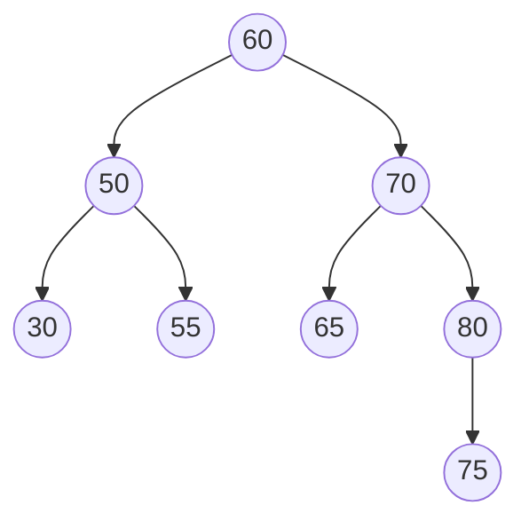

# Binary Search Tree: Search

## Binary Search Tree
A binary search tree is a binary tree where:
- Every nodes left sub-tree contains values that are less than or equal to the nodes value
- Every nodes right sub-tree contains values that are greater than or equal to the nodes value
- Both, left and right, binary trees are also binary search trees



## Searching
To search an item within a binary search tree we must use recursion.

We begin by examining the root:
- If the given item equals to the item at the root, we return true
- If the given item is less than the item at the root, we recursively search the left
sub-tree in the same manner
- If the given item is greater than the item at the root, we recursively search the right
sub-tree in the same manner

## Algorithm
```
ALGORITHM Search(K, root)
if root != null
    if root.item = K
        return true
    else
        if root.item < K
            return Search(K, root.rchild)
        else
            return Search(K, root.lchild)
else
    return false
```
