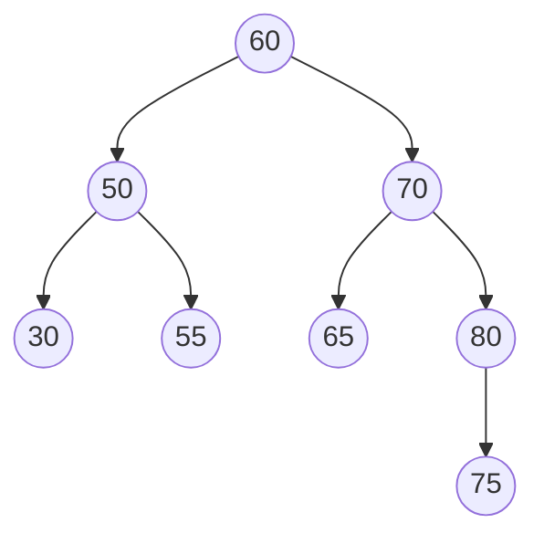
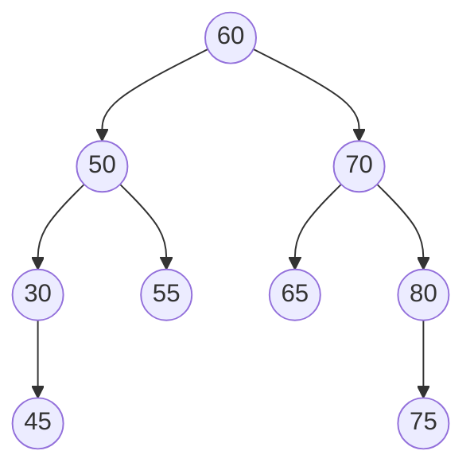

# Binary Search Tree: Insert

## Inserting
To insert an item within a binary search tree we must first recursively search
for the correct place to insert, and once found, add it below that item.

For example, given the current tree and the value 45 to insert



After our insertion, our tree would look as follows,




## Algorithm
```
ALGORITHM Insert(K, root)
if root = null
    ptr <- new BTNode
    ptr.item <- K
    root <- ptr
else
    if root.item > K
        if root.lchild = null
            ptr <- new BTNode
            ptr.item <- K
            root.lchild <- ptr
        else
            Insert(K, root.lchild)
    else
        if root.rchild = null
            ptr <- new BTNode
            ptr.item <- K
            root.rchild <- ptr
        else
            Insert(K, root.rchild)
```
