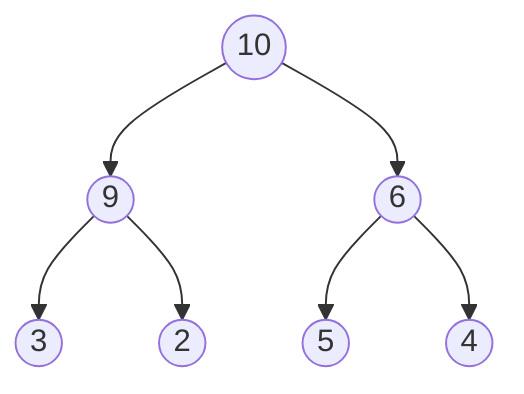

# Heaps and Heap Bottom Up

## Heaps
A heap is a complete binary tree that is either empty or whose root contains
a search key that is greater than or equals to the search key in each of its
children and has heaps as its sub-trees.

This type of heap is also know as a maximum heap.



## Heap Bottom Up
The heap bottom up algorithm converts a binary tree into a heap.

```
ALGORITHM HeapBottomUp(H[1..n])
// Constructs a heap from elements of a given array via the bottom-up algorithm
// Input: An array H[1..n] or orderable elements
// Output: A heap H[1..n]

for i <- floor(n/2) downto 1 do
    k <- i
    v <- H[k]
    heap <- false
    
    while not heap and 2 * k <= n do
        j <- 2 * k

        if j < n then
            if H[j] < H[j + 1] then
                j <- j + 1

            if v >= H[j] then
                heap <- true
            else
                H[k] <- H[j]
                k <- j
    H[k] <- v
```
