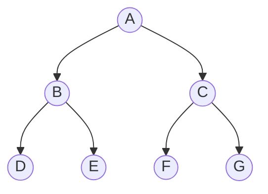
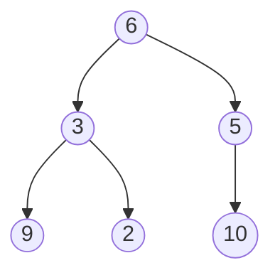

# Heap Sort & Complete Binary Trees

## Heap Sort
Heap sort is a non-stable transform-and-conquer algorithm generally split into two stages:
1. Transformation
2. Conquer

```
ALGORITHM Heapsort(A[0..n-1])
// Sorts array A into non-decreasing order

HeapBottomUp procedure
for v <- 0 to n-2 do
    Use MaximumKeyDeletion process to delete the root of the heap
```

Heapsort has a worst-case time efficiency of:

\\[
    C_{worst}(n) \in O(n \log n)
\\]

## Complete Binary Tree
A complete binary tree of height \\(h\\), is a binary tree that is full down to
level \\(h-1\\), with level \\(h\\) filled in from left-to-right.

All nodes at level \\(h-2\\) and above each have two children. When a node at level
\\(h-1\\) has children, then all nodes to its left, at the same level, must have
two children each.

When a node at level \\(h-1\\) has one child, it must be a left child.

For example, this is a complete binary tree:


A complete binary tree can be implemented in an array:
- The root is stored at index 0
- If a node is stored at index \\(i\\) in the array:
    - The left child of the node is stored at index \\(2*i+1\\), if it exists
    - The right child of the node is stored at index \\(2*i+2\\), if it exists
    - The parent of the node is stored at index \\((i-l)/2\\), if it is not the root

For example, this complete binary tree can be represented as such `[6, 3, 5, 9, 2, 10]`

_* Note: Imagine the connection from node `5 -> 10` is directed left_

