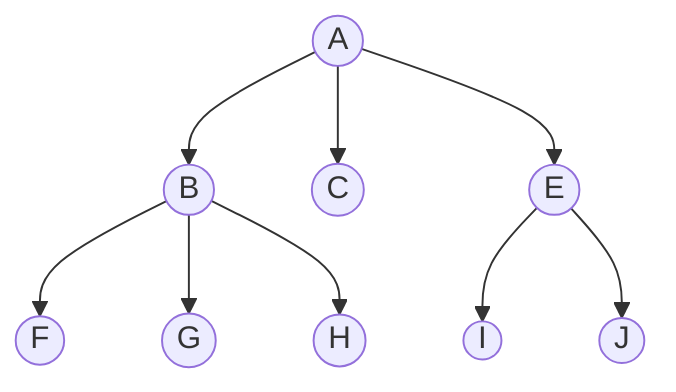

# Breadth First Traversal

In a breadth-first traversal algorithm, we visit all nodes in a tree in order
of their depth. It will first visit all nodes, left to right, at depth zero, then visit all 
nodes at depth one, and so on until all nodes are traversed.

## Pseudocode

```
ALGORITHM BreadthFirstTraversal(root)
q <- empty queue
q.enqueue(root)

while q != empty queue do
    r <- q.dequeue()
    visit r
    r <- r.firstchild

    while r != null do
        q.enqueue(r)
        r <- r.firstsibling
```

## Example



Queue q:
- Initially - [ A ]
- After visiting A - [ B, C, E ]
- After visiting B - [ C, E, F, G, H ]
- After visiting C - [ E, F, G, H ]
- After visiting E - [ F, G, H, I, J ]
- After visiting F - [ G, H, I, J ]  
- After visiting G - [ H, I, J ]
- After visiting H - [ I, J ]
- After visiting I - [ J ]
- After visiting J - [ ]
