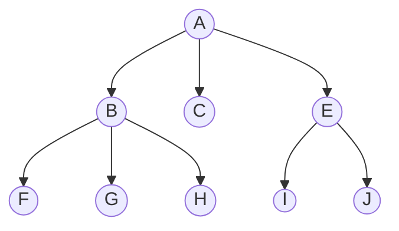

# Depth First Traversal

In a depth-first traversal algorithm, we start at the root and traverse each sub-tree
in depth-first order from left to right.

## Pseudocode

```
ALGORITHM DepthFirstTraversal(root)
s <- empty stack
s.push(root)

while s != empty stack do
    r <- s.pop()

    repeat
        visit r
        
        if r.firstsibling != null then
            s.push(r.firstsibling)

        r <- r.firstchild
    until r = null
            
```

## Example



Stack s:
- Initially - [ A ]
- After visiting A - [ ]
- After visiting B - [ C ]
- After visiting F - [ C, G ]
- After visiting G - [ C, H ]
- After visiting H - [ C ]  
- After visiting C - [ E ]
- After visiting E - [ ]
- After visiting I - [ J ]
- After visiting J - [ ]
