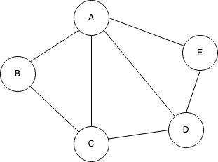
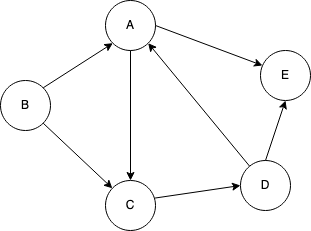

# Graphs

## Graph
A graph \\(G\\) consists of two sets:
1. A set \\(V\\) of vertices
2. A set \\(E\\) of edges that connect the vertices

For example:
- \\(G = ( V, E )\\)
- \\(V = \\{A, B, C, D, E\\}\\)
- \\(E = \\{(A, B), (A, C), (A, D), (A, E), (B, C), (C, D), (D, E)\\}\\)

## Terminology

### Undirected Graph
In an undirected graph, edges do not indicate any direction.

### Directed Graph
In an directed graph, edges indicate a direction of flow.

### Weighted Graph
In an weighted graph, edges have a weight/value associated with them.

### Path
A path between two vertices is the sequence of consecutive edges beginning at one
vertex and ending at another.

For example, e1 - e3 - e4 is a path between A and D:

### Cycle
A cycle is a path that begins and ends at the same vertex.

For example, e1 - e3 - e6 is a cycle beginning and ending at A:

### Connected Graph
A graph is considered to be connected if there exists a path between each pair
of distinct vertices.

  
**Figure: Connected Graph**

  
**Figure: Disconnected Graph**

### Subgraph
A subgraph is a graph within a greater graph consisting of a subset of the greater 
graphs vertices and a subset of the greater graphs edges.
